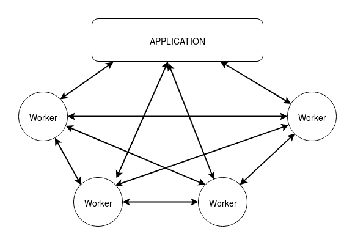
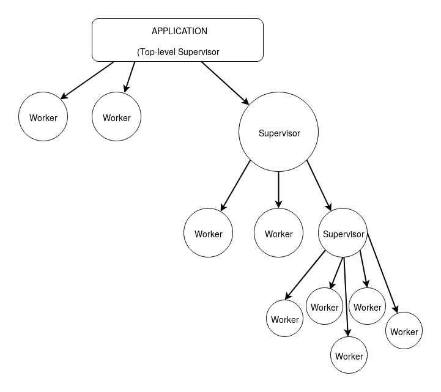
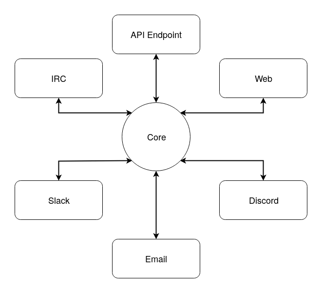

## Architectures Résilientes
## Avec Erlang/OTP et Elixir

<small>Vente Privée 08/12/2017</small>

---

### Sommaire: 

1. Modéliser son architecture

2. Superviser son architecture

3. Renforcer son architecture

4. Distribuer son architecture

---

## Modéliser son architecture

---

### Modéliser son architecture

>Hours of programming can save weeks of planning

---

### Modéliser son architecture

>Investir une heure de temps de cerveau peut épargner un mois de réécriture

---

### Modéliser son architecture


---

### Le Worker, unité de base du modèle d'acteur

Il sait tout faire !

```
* Calculer fibonacci
* Envoyer des requêtes SQL
* Sérialiser du JSON
* Exposer un serveur web
* ➡️ Bam, Fibonacci As A Service!
```

@[1](Du calcul)
@[2](Garder un file descriptor en mémoire)
@[3](Ton client HTTP)
@[4](Ton format de données)
@[5](Ta prochaine startup !)

---

## Superviser son architecture

---

### Point de cours

<dl>
<dt>Superviser</dt>
  <dd>Lier un processus (supervisé) à un autre processus (superviseur) à son démarrage</dd>
  <br />
<dt>Stratégie</dt>
  <dd>Le plan d'action qui va être mis en place à la mort d'un processus supervisé</dd>
</dl>

---

### Stratégies

<dl>
  <dt>`one_for_one`</dt>
    <dd>Tu meurs, tu reviens à la vie</dd>
  <br />
  <dt>`one_for_all`</dt>
    <dd>Ta pote meure, t'es bonne pour y passer aussi :/</dd>
</dl>

---
### Stratégies 

<dl>
  <dt>`rest_for_one`</dt>
    <dd>C'est toi le facteur biologique, tous les poulets qui sont nés après toi vont passer à la trappe</dd>
  </br />
  <dt>`simple_one_for_one`</dt>
  <dd>Les processus vont démarrer et s'arrêter pendant l'execution de l'application, dans 30 secondes ou 10 ans.</dd>
</dl>

---

### Superviser



---

## Renforcer son application

---

### Renforcer

* Lui donner une base stable

* Pratiquer un niveau d'isolation supérieur à la simple supervision ou aux acteurs

---

### Renforcer

OTP est une histoire de composants

---

### Renforcer

OTP est une histoire de composants

* Micro-composants
* Moyen-composants
* Macro-composants

@[1](Le processus, l'acteur)
@[2](L'application OTP)
@[3](Les regroupemments d'applications)

---

### Renforcer

<dl>
  <dt>Umbrella</dt>
  <dd>Les projets "umbrella" sont utilisés (et utiles) pour gérer plusieurs applications OTP à la fois.</dd>
</dl>

---

### Renforcer

On peut ainsi séparer les composants en : 

* Core
* Web
* Email
* IRC
* Discord
* Slack
* Endpoint API

@[1](Un `Core` qui va s'occuper des relations à la base de données)
@[2](Une interface `Web` avec ses controlleurs, son routeur et ses templates)
@[3](L'adaptateur `Email` pour le top-management entre deux formations chez SAP)
@[4](L'adaptateur `IRC` pour les bourrines sur emacs)
@[5](L'adaptateur `Discord` pour les gamers du helpdesk )
@[6](L'adaptateur `Slack` pour le middle-management)
@[7](L'API JSON/GraphQL pour les tierces-parties)

---

### Isoler sans risque



---

### Isoler sans risque

On peut alors éteindre de façon arbitraire l'application qui s'occupe de l'API, bazarder IRC… <sup><sup><small>xkcd.com/1782</small></sup></sup>


--- 

### Isoler sans risque

Avarie sur l'interface web ?  

On reçoit quand même les notifications sur la DB, l'API, dans les messageries.

---

## Distribuer son architecture

---

### Distribuer

OTP nous offre de façon claire un outil qui permet de définir un cluster d'applications

---

### Distribuer

```Erlang
==> node1.config <==
[{kernel,
  [
    {distributed, [{g4, 5000, ['node1@127.0.0.1', 'node2@127.0.0.1', 'node3@127.0.0.1']}]},
    {sync_nodes_optional, ['node2@127.0.0.1', 'node3@127.0.0.1']},
    {sync_nodes_timeout, 2000}
  ]}
].

==> node2.config <==
[{kernel,
  [
    {distributed, [{g4, 5000, ['node1@127.0.0.1', 'node2@127.0.0.1', 'node3@127.0.0.1']}]},
    {sync_nodes_optional, ['node1@127.0.0.1', 'node3@127.0.0.1']},
    {sync_nodes_timeout, 2000}
  ]}
].

==> node3.config <==
[{kernel,
  [
    {distributed, [{g4, 5000, ['node1@127.0.0.1', 'node2@127.0.0.1', 'node3@127.0.0.1']}]},
    {sync_nodes_optional, ['node1@127.0.0.1', 'node2@127.0.0.1']},
    {sync_nodes_timeout, 2000}
  ]}
].

```

---

### Distribuer


```Nginx
# À insérer dans le block `http` de `nginx.conf`
    upstream g4 {
        server 127.0.0.1:4001;
        server 127.0.0.1:4002;
        server 127.0.0.1:4003;
    }
```

---

### Distribuer

```Shell
start-dist.sh
#!/bin/s

PORT=400${1} iex --name node${1}@127.0.0.1 --erl "-config config/node${1}.config" -S mix phx.server
```

---
## DEMO !

---

### *Fin*

Référence:

>Cesarini, Vinoski – Designing for Scalability with Erlang/OTP

Moi:

* @TechnoEmpress
* github.com/tchoutri

